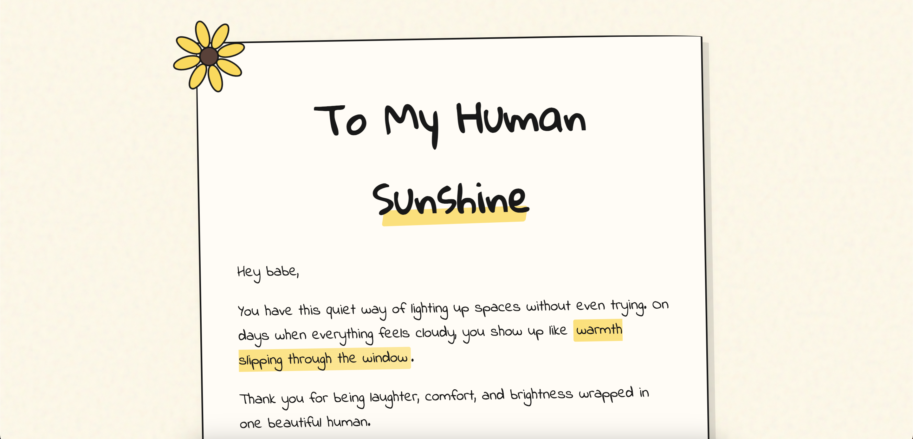

# 404-love-found 🌻❤️

A playful, customizable romantic website template built with React.  
Because sometimes love gets lost, until it is found again.

## Demo



Click to view live: [Live link](https://404-love-found.vercel.app)

## Overview

`404-love-found` is designed for creating personalized digital experiences with photos, messages, memories, and themed UI sections.

It blends emotional storytelling with reusable component architecture and modern frontend practices, while staying easy to customize, deploy, and share.

## Features

- Fully editable romantic website template
- Modular and reusable React component structure
- Responsive design (mobile friendly)
- Themed UI interactions and animations
- Custom playful 404 error experience

## Tech Stack

- React
- JavaScript
- CSS
- Vite

## Getting Started

1. Clone the repository:

```bash
git clone https://github.com/trevorcj/404-love-found.git
cd 404-love-found
```

2. Install dependencies:

```bash
npm install
```

3. Start the development server:

```bash
npm run dev
```

4. Build for production:

```bash
npm run build
```

## Project Motivation

This project explores:

- Emotional UX design
- Component-driven UI development
- Reusable themed template creation
- Combining storytelling with development

## Use Cases

- Valentine or appreciation gifts
- Anniversary memory pages
- Friendship storytelling sites
- Creative frontend experiments
- Personalized digital keepsakes

## Support

If you like this project, consider giving it a star ⭐️
